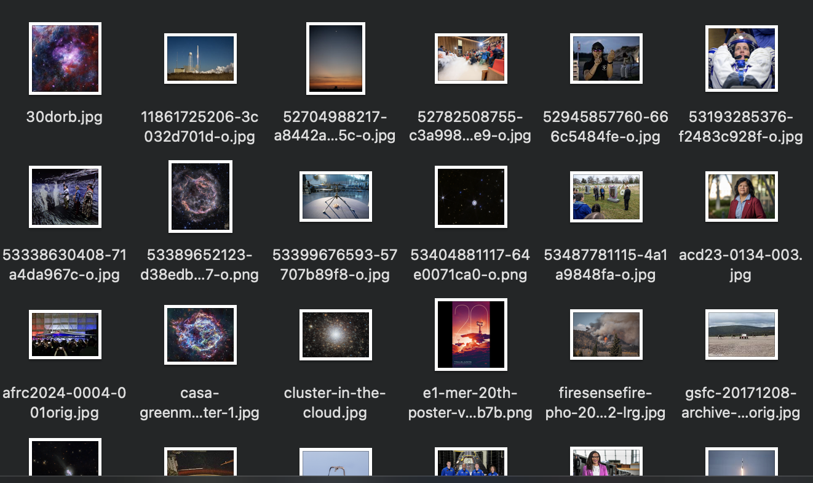

# NasaGO


# Objective

The objective of this project is to create a go script that will fetch the latest image of the day from the NASA image of the day website.

Later, I will add the functionality to download the image and set it as the wallpaper automatically.

# Usage

To use this script, you will need to have go installed on your system. You can download it from [here](https://golang.org/dl/).

Once you have go installed, you can run the following command to get the image of the day:

```bash
go run main.go
```

# How it works

It is decomposed into two main parts:

1. Fetching the image of the day from the NASA website.
2. Downloading each image.

## Fetching the image of the day from the NASA website

To fetch the image of the day, I used the [colly library](https://github.com/gocolly/colly). This library is a fast and flexible web scraping framework. It is used to extract the links to each image of the day from the NASA website.
With the links, I can now request the images in high resolution from their own specific page.

## Downloading each image

To download the images, I used the [net/http](https://pkg.go.dev/net/http) library. This library is used to download the images from the links I extracted from the NASA website.
All I have to do is to send a GET request to the link and save the response body to a file that I name based on the title of the image.

# Future improvements

In the future, I will add the functionality to set the image as the wallpaper automatically with crontabs.

# Output




